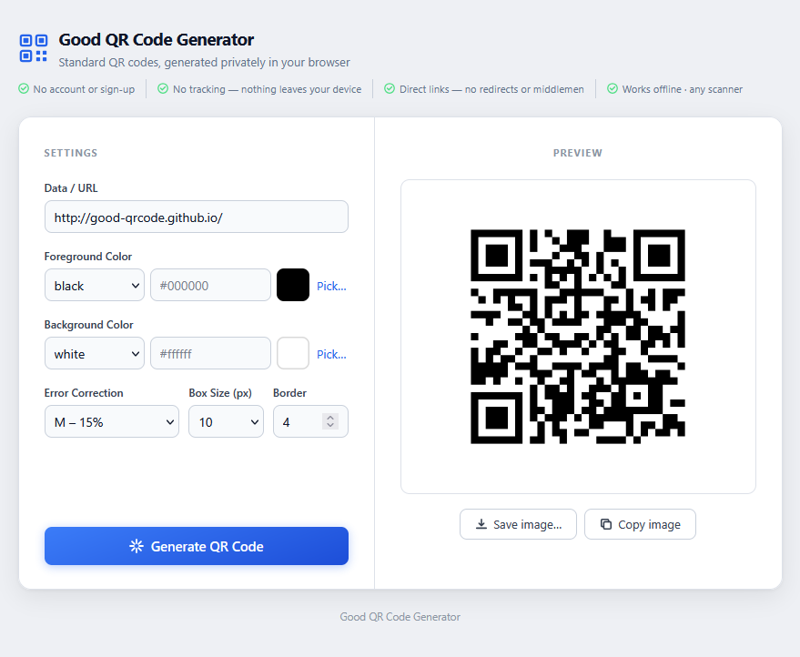
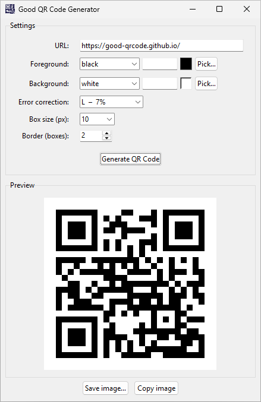

# Good QR Code Generator

Generate standard QR codes — locally, privately, without fuss.

Most QR code tools make you sign up, show you ads, log what you encode, or wrap your link in a redirect that breaks the day they shut down. **Good QR Code Generator** doesn't do any of that. Everything runs on your own machine or in your own browser. No internet connection required, no account, no tracking — just a QR code that works with any scanner.

---

## Two flavours, same philosophy

| | [Web](web/) | [Desktop](desktop/) |
|---|---|---|
| **What it is** | Single-page HTML | Native app (Python / Tkinter) |
| **Platforms** | Any modern browser | Windows, macOS, Linux |
| **How to run** | Open `index.html` — no server needed | Download binary or run from source |
| **Output formats** | PNG (save or copy to clipboard) | PNG, JPEG, BMP, GIF, TIFF, WebP, ICO |

Both versions support colour customisation, transparent backgrounds, error correction levels, and adjustable module size and quiet-zone border.

| Web | Desktop |
|---|---|
|  |  |

---

## Getting started

**Web app** → open [web/index.html](web/index.html) in your browser, or see [web/README.md](web/README.md)

**Desktop app** → see [desktop/README.md](desktop/README.md)

---

## License

[MIT](LICENSE)
